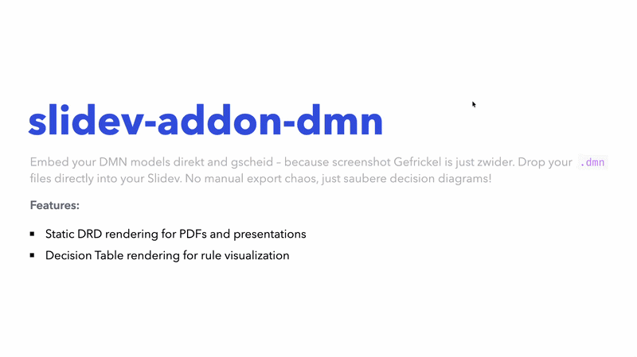

# slidev-addon-dmn

[](https://www.npmjs.com/package/slidev-addon-dmn)
[](https://github.com/emaarco/slidev-addon-dmn/blob/main/LICENSE)
[](https://emaarco.github.io/slidev-addon-dmn/)

Display DMN decision tables and DRD diagrams in your [Slidev](https://sli.dev/) presentations. Whether you're presenting decision logic, explaining business rules, or teaching DMN concepts — this addon has you covered!

Powered by [dmn-js](https://bpmn.io/toolkit/dmn-js/) from bpmn.io.

## Quick Start

1. Install the addon in your Slidev project
2. Place your `.dmn` files in the `public/` folder
3. Use the `<DmnDrd>` or `<DmnTable>` components in your slides

That's it — your DMN diagrams are ready to present!

## Example Slide



## Installation

```bash
npm install slidev-addon-dmn
```

Then register the addon in your slide's frontmatter:

```yaml
---
addons:
  - slidev-addon-dmn
---
```

Or in your `package.json`:

```json
{
  "slidev": {
    "addons": ["slidev-addon-dmn"]
  }
}
```

## Components

This addon provides two complementary components for different use cases:

- **`<DmnDrd>`** - Static DRD rendering for PDFs, presentations, and documentation
- **`<DmnTable>`** - Decision Table rendering for visualizing business rules

## Component Reference

### DmnDrd Component

Renders Decision Requirements Diagrams as static SVG images. Perfect for PDF exports and presentations.

```vue
<DmnDrd
  dmnFilePath="./my-decisions.dmn"
  width="100%"
  height="400px"
/>
```

**Props:**

| Name | Type | Default | Description |
|------|------|---------|-------------|
| `dmnFilePath` | `string` | *required* | Path to the `.dmn` file (relative to `public/`) |
| `width` | `string` | `'100%'` | Maximum width of the diagram |
| `height` | `string` | `'auto'` | Height of the diagram |
| `fontSize` | `string` | `'12px'` | Font size of the diagram labels |

### DmnTable Component

Renders DMN Decision Tables directly in the slide. Perfect for presenting business rules and decision logic.

```vue
<DmnTable
  dmnFilePath="./my-decisions.dmn"
  width="100%"
  decisionId="Decision_Dish"
/>
```

**Props:**

| Name | Type | Default | Description |
|------|------|---------|-------------|
| `dmnFilePath` | `string` | *required* | Path to the `.dmn` file (relative to `public/`) |
| `width` | `string` | `'100%'` | Width of the table container |
| `height` | `string` | `'auto'` | Height of the table container (defaults to 500px when 'auto') |
| `decisionId` | `string` | *first found* | ID of the decision to display (optional, defaults to the first decision table) |
| `fontSize` | `string` | `'12px'` | Font size of the table content |
| `showAnnotations` | `boolean` | `false` | Show or hide the annotations column |

## Tips

- **File location**: DMN files must be placed in the `public/` folder
- **Supported formats**: Standard DMN 1.3 XML files (exported from Camunda Modeler, bpmn.io, etc.)
- **Multiple decisions**: Use the `decisionId` prop to select a specific decision table when your DMN file contains multiple decisions
- **Styling**: Use Tailwind classes via the `class` prop to control sizing
- **Export**: The `<DmnDrd>` component works seamlessly with Slidev's PDF/PNG export features

## Contributing

Contributions are welcome! Feel free to report bugs, suggest features via [issues](https://github.com/emaarco/slidev-addon-dmn/issues), submit pull requests with improvements, or share your ideas and use cases.

To develop locally: clone the repo, run `npm install`, then `npm run dev` to test your changes.

## Credits

- [dmn-js](https://github.com/bpmn-io/dmn-js) by [bpmn.io](https://bpmn.io/)
- Inspired by [slidev-addon-bpmn](https://github.com/emaarco/slidev-addon-bpmn)
- [bavaria-ipsum](https://bavaria-ipsum.de/) - for making the example slide a little more entertaining
