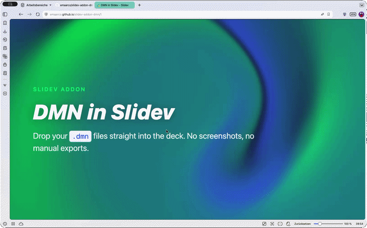

# 📊 slidev-addon-dmn

[](https://www.npmjs.com/package/slidev-addon-dmn)
[](https://github.com/emaarco/slidev-addon-dmn/blob/main/LICENSE)
[](https://emaarco.github.io/slidev-addon-dmn/)

Display DMN decision tables and DRD diagrams in your [Slidev](https://sli.dev/) presentations. Whether you're presenting decision logic, explaining business rules, or teaching DMN concepts — this addon has you covered! 💡

Powered by [dmn-js](https://bpmn.io/toolkit/dmn-js/) from bpmn.io.

## 🚀 Quick Start

1. Install the addon in your Slidev project
2. Place your `.dmn` files in the `public/` folder
3. Use the `<DmnDrd>`, `<DmnTable>`, `<DmnSimulate>` or `<DmnModeler>` components in your slides

That's it — your DMN diagrams are ready to present!

## Example Slide



## 📦 Installation

```bash
npm install slidev-addon-dmn
```

Then register the addon in your slide's frontmatter:

```yaml
---
addons:
  - slidev-addon-dmn
---
```

Or in your `package.json`:

```json
{
  "slidev": {
    "addons": ["slidev-addon-dmn"]
  }
}
```

## 🧩 Components

This addon provides four complementary components for different use cases:

- **`<DmnDrd>`** - Static DRD rendering for PDFs, presentations, and documentation
- **`<DmnTable>`** - Decision Table rendering for visualizing business rules
- **`<DmnSimulate>`** - Decision Table with an input form: evaluate the decision live and highlight the matching rule (DMN's answer to BPMN token simulation)
- **`<DmnModeler>`** - Interactive DMN modeler for live editing during workshops and trainings, with an optional Camunda properties panel

## 🔧 Component Reference

### DmnDrd Component

Renders Decision Requirements Diagrams as static SVG images. Perfect for PDF exports and presentations.

```vue
<DmnDrd
  dmnFilePath="./my-decisions.dmn"
  width="100%"
  height="400px"
/>
```

**Props:**

| Name | Type | Default | Description |
|------|------|---------|-------------|
| `dmnFilePath` | `string` | *required* | Path to the `.dmn` file (relative to `public/`) |
| `width` | `string` | `'100%'` | Maximum width of the diagram |
| `height` | `string` | `'auto'` | Height of the diagram |
| `fontSize` | `string` | `'12px'` | Font size of the diagram labels |

### DmnTable Component

Renders DMN Decision Tables directly in the slide. Perfect for presenting business rules and decision logic.

```vue
<DmnTable
  dmnFilePath="./my-decisions.dmn"
  width="100%"
  decisionId="Decision_Dish"
/>
```

**Props:**

| Name | Type | Default | Description |
|------|------|---------|-------------|
| `dmnFilePath` | `string` | *required* | Path to the `.dmn` file (relative to `public/`) |
| `width` | `string` | `'100%'` | Width of the table container |
| `height` | `string` | `'auto'` | Height of the table container (defaults to 500px when 'auto') |
| `decisionId` | `string` | *first found* | ID of the decision to display (optional, defaults to the first decision table) |
| `fontSize` | `string` | `'12px'` | Font size of the table content |
| `showAnnotations` | `boolean` | `false` | Show or hide the annotations column |
| `showDrdButton` | `boolean` | `false` | Show or hide the built-in "View DRD" button |

### DmnSimulate Component

Renders a Decision Table together with an input form and evaluates it live. Pick the inputs, hit **Simulate**, and the matching rule row is highlighted while the resulting output is shown below the table. Because DMN is declarative (no wandering token like BPMN), this is the DMN equivalent of a token simulation: feed inputs in, watch which rule fires. FEEL expressions are evaluated with the [feelin](https://github.com/nikku/feelin) engine.

Use the **Fullscreen** button next to the form to blow the whole simulation up to the full viewport — handy for wide tables in workshops. Press **Escape** or click **Exit** to return to the slide; the current inputs and result are preserved.

```vue
<DmnSimulate
  dmnFilePath="./my-decisions.dmn"
  width="100%"
  height="340px"
/>
```

**Props:**

| Name | Type | Default | Description |
|------|------|---------|-------------|
| `dmnFilePath` | `string` | *required* | Path to the `.dmn` file (relative to `public/`) |
| `width` | `string` | `'100%'` | Width of the container |
| `height` | `string` | `'340px'` | Height of the decision table |
| `decisionId` | `string` | *first found* | ID of the decision to simulate (defaults to the first decision table) |
| `fontSize` | `string` | `'12px'` | Font size of the table content in the slide |
| `fullscreenFontSize` | `string` | `'12px'` | Font size of the table content in fullscreen (raise it so the table reads from the back of the room) |
| `showAnnotations` | `boolean` | `false` | Show or hide the annotations column |
| `showDrdButton` | `boolean` | `false` | Show or hide the built-in "View DRD" button |

> **Hit policies:** the full DMN set is supported — `UNIQUE`, `ANY`, `PRIORITY`, `FIRST`, `COLLECT` (incl. `SUM`/`MIN`/`MAX`/`COUNT` aggregation), `RULE ORDER` and `OUTPUT ORDER`. The rule(s) the policy actually reports are highlighted strongly; rules that merely matched but were dropped (e.g. under `FIRST`/`PRIORITY`) are shown as faint candidates. `PRIORITY` and `OUTPUT ORDER` use the output's `<outputValues>` list as the priority order. `UNIQUE`/`ANY` show a violation badge when their constraint is broken. Input cells are evaluated as FEEL unary tests via [feelin](https://github.com/nikku/feelin); an empty cell matches any value.
>
> The [`example.md`](./example.md) deck includes one slide per hit policy (`public/hit-policies/*.dmn`) demonstrating each behaviour live.

### DmnModeler Component

Embeds an interactive DMN modeler for live editing. A thumbnail of the DRD is shown in the slide; clicking **Edit** opens the model fullscreen where you can rearrange the DRD and double-click a decision to edit its table. On **Close**, any changes are reflected back in the slide thumbnail. Ideal for workshops, trainings, and collaborative sessions.

```vue
<DmnModeler
  dmnFilePath="./my-decisions.dmn"
  width="100%"
  height="500px"
/>
```

Or start with a blank canvas:

```vue
<DmnModeler height="500px" />
```

Pass `engine="camunda"` to mount the Camunda properties panel side-by-side with the canvas, so you can edit ids, names, and Camunda-specific execution properties live:

```vue
<DmnModeler dmnFilePath="./my-decisions.dmn" engine="camunda" height="500px" />
```

In fullscreen mode, the panel can be hidden and shown again via the toolbar — handy when you need the full canvas width.

**Props:**

| Name | Type | Default | Description |
|------|------|---------|-------------|
| `dmnFilePath` | `string` | — | Optional path to a `.dmn` file (relative to `public/`). Omit for a blank diagram. |
| `width` | `string` | `'100%'` | Width of the modeler container |
| `height` | `string` | `'500px'` | Height of the modeler container |
| `engine` | `'camunda'` | — | Optional engine. Mounts a `dmn-js-properties-panel` configured for Camunda. Omit for a panel-less modeler. |

## 💡 Tips

- **File location**: DMN files must be placed in the `public/` folder
- **Supported formats**: Standard DMN 1.3 XML files (exported from Camunda Modeler, bpmn.io, etc.)
- **Multiple decisions**: Use the `decisionId` prop to select a specific decision table when your DMN file contains multiple decisions
- **Styling**: Use Tailwind classes via the `class` prop to control sizing
- **Export**: The `<DmnDrd>` component works seamlessly with Slidev's PDF/PNG export features

## 🔗 Related

> **Looking for BPMN?** If you're modeling business processes alongside your decisions, check out
> [slidev-addon-bpmn](https://github.com/emaarco/slidev-addon-bpmn) — the sister addon for rendering
> BPMN diagrams in Slidev!

## 🤝 Contributing

Contributions are welcome! Feel free to report bugs, suggest features via [issues](https://github.com/emaarco/slidev-addon-dmn/issues), submit pull requests with improvements, or share your ideas and use cases.

To develop locally: clone the repo and run `npm install`. The dev server runs behind
[portless](https://portless.sh) (a pinned devDependency — no global install) for a stable,
git-worktree-aware `.localhost` URL. Install the proxy daemon once per machine (needs sudo once):

```bash
npx portless service install
```

Then run the example presentation:

```bash
npm run dev        # via portless → https://slidev-addon-dmn.localhost
                   # (in a git worktree → https://<worktree>.slidev-addon-dmn.localhost)
npm run dev:app    # or run the Slidev server directly, without portless
```

## 🙏 Credits

- [dmn-js](https://github.com/bpmn-io/dmn-js) by [bpmn.io](https://bpmn.io/)
- [bavaria-ipsum](https://bavaria-ipsum.de/) - for making the example slide a little more entertaining 🥨
